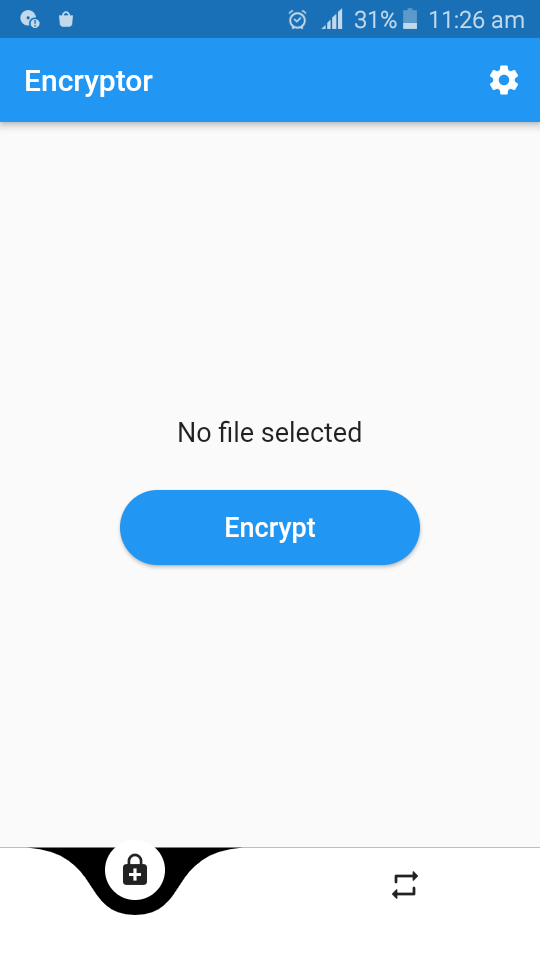
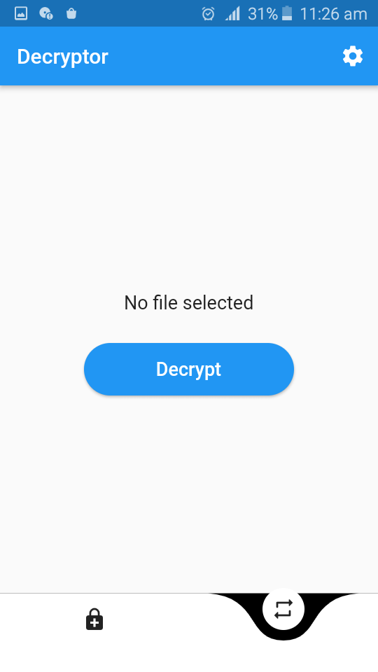
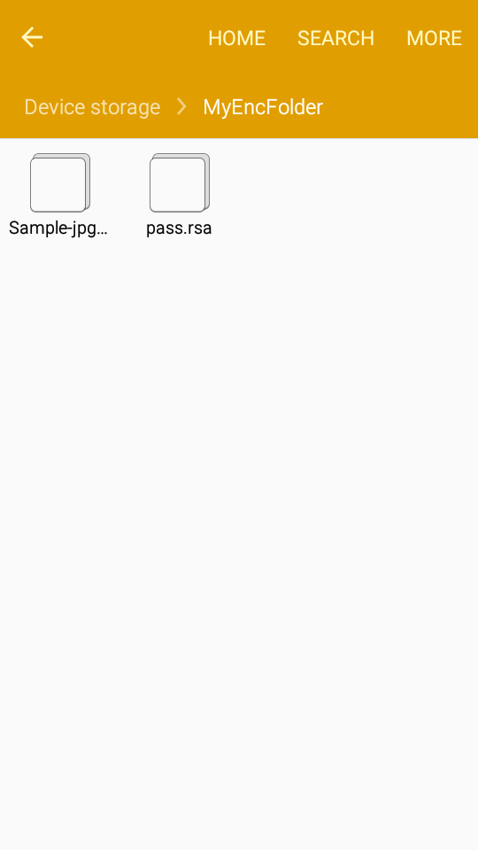
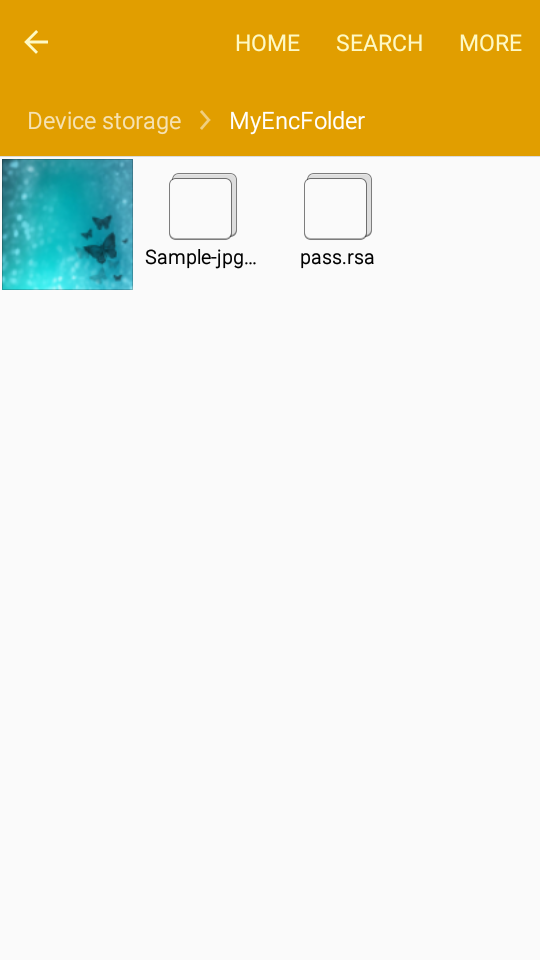
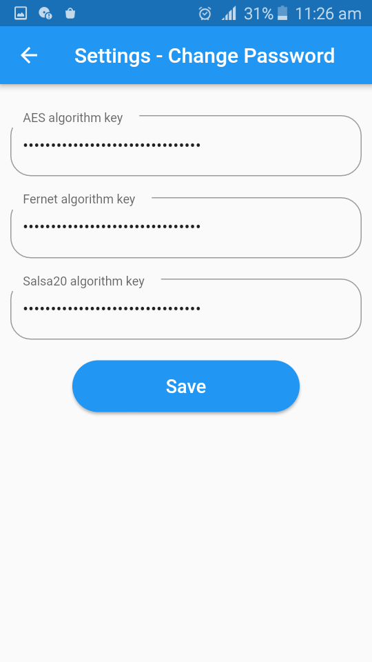

# Encryptor App

Introduction:
===============
A simple encryption app to encrypt user data in android mobile phone. Hybrid encryption is used.
The data to be encrypted is split into three parts and encrypted with algorithms.

Algorithms used:
===============

Symmetric algorithms:
--------------------
     1.AES
     2.Salsa20
     3.Fernet

Asymmetric algorithm:
--------------------
RSA algorithm(for encryption of private keys)        

Feature:
===============
The order of encryption of the algorithms are randomized.

Application Guide:
==================
<!-------->
1.The <b>encryptor page</b> is used to encrypt user data 
 
2.The <b>decryptor page</b> is to decrypt the encrypted data  
 
3.The encrypted and decrypted data are stored in the phone storage in <b>MyEncFolder</b>  

 
4.The passwords can be changed in the <b>settings page</b>  
